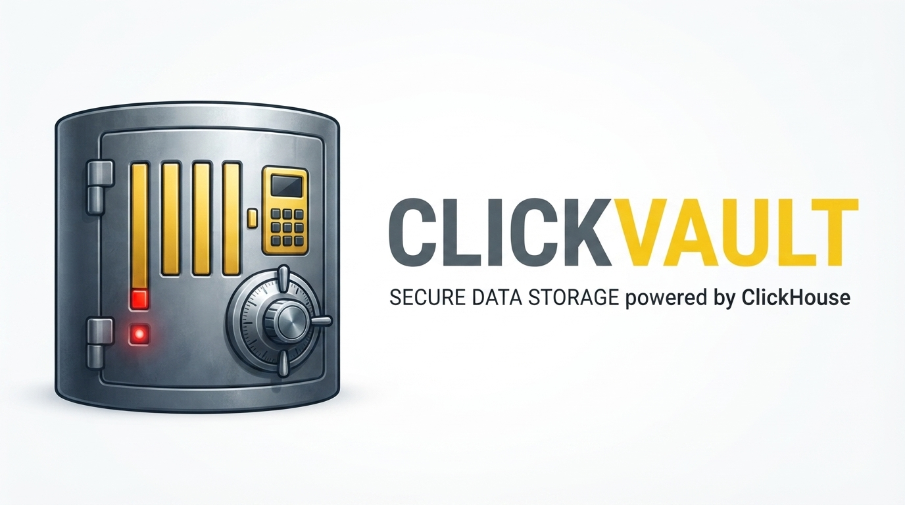

<picture>
  <source media="(prefers-color-scheme: dark)" srcset="assets/images/clickvault-banner-dark.png">
  
</picture>

[](https://github.com/emiliano-go/clickvault/actions/workflows/ci.yml)
[](https://codecov.io/gh/emiliano-go/clickvault)
[](https://go.dev/doc/devel/release)
[](LICENSE)

A HashiCorp Vault database secrets engine plugin for ClickHouse. ClickVault lets Vault create short-lived ClickHouse users on demand (dynamic secrets) and rotate passwords of long-lived users on a schedule (static roles), so applications never handle a standing ClickHouse credential directly.

---

## Quick start

Build the plugin, register it with Vault, and create a dynamic role:

```bash
make build-linux-amd64
SHA256=$(sha256sum bin/clickvault-linux-amd64 | awk '{print $1}')

vault secrets enable database

vault plugin register \
  -sha256="$SHA256" \
  database clickvault

vault write database/config/pos-clickhouse \
  plugin_name=clickvault \
  connection_url="clickhouse://clickhouse:9000" \
  username="vault_admin" \
  password="$CLICKHOUSE_VAULT_ADMIN_PASSWORD"

vault write database/roles/pos-analytics-dynamic \
  db_name=pos-clickhouse \
  creation_statements='CREATE USER "{{username}}" IDENTIFIED WITH sha256_password BY '"'"'{{password}}'"'"'; GRANT analytics ON default.* TO "{{username}}";' \
  default_ttl="24h" \
  password_policy="clickhouse-password-policy"
```

Read a lease:

```bash
vault read database/creds/pos-analytics-dynamic
```

Vault creates a new ClickHouse user and drops it when the lease expires or is revoked. That is it.

[Full quick start with static roles and cluster setup &rarr;](docs/quick-start.md)

---

## Why clickvault

Managing ClickHouse credentials by hand means embedding passwords in config files, rotating them manually, and leaving a trail of standing credentials across environments. Every credential is a blast radius waiting to happen.

ClickVault replaces standing keys with on-demand, short-lived credentials. No shared secrets, no password spreadsheets, no rotation scripts. Vault becomes the single source of truth for every ClickHouse credential in your infrastructure.

---

## Key features

| Category | What clickvault handles |
|---|---|
| **Dynamic credentials** | Ephemeral ClickHouse users created on demand, automatically dropped when leases expire |
| **Static role rotation** | Scheduled password rotation for existing long-lived users |
| **Cluster-aware DDL** | Automatic `ON CLUSTER` insertion at ClickHouse's grammatically correct position |
| **SQL injection prevention** | Rejects values containing quotes, backticks, or control characters before substitution |
| **Concurrency-safe** | Single `sync.RWMutex` protects the connection and config from Vault's concurrent calls |
| **TLS support** | Configurable TLS, dial timeout, and read timeout on the ClickHouse connection |
| **Username collision guard** | Checks for existing users before creating, fails with a clear error on truncated-name collisions |

---

## Security

ClickHouse DDL cannot be parameterized, so ClickVault substitutes generated values as literal text. It rejects any value containing a single quote, double quote, backtick, backslash, or control character a user create/rotate fails rather than running unsafe SQL. The database handle is protected by a mutex held across the entire operation, preventing TOCTOU races. TLS, dial timeouts, and read timeouts are configurable per connection.

---

## Build & test

```bash
make build              # bin/clickvault
make test               # unit tests (no Docker needed)
go test -tags=integration ./tests/...  # integration tests (requires Docker)
```

Unit tests mock the database with `go-sqlmock` and need no external services. Integration tests spin up a real ClickHouse container and drive the full lifecycle.

---

### Coverage

Expected test coverage is 85.4% of `internal/clickvault` (`clickvault.go`, `ddl.go`). The root package (`main.go`, the plugin entrypoint) is excluded from meaningful coverage since it only calls `dbplugin.ServeMultiplex`, bringing the project-wide Codecov total to ~78%.

Coverage reports are generated automatically by CI (`go test -coverprofile=coverage.txt`) and uploaded to [Codecov](https://codecov.io/gh/emiliano-go/clickvault). The `codecov.yml` config enforces a project-level target of 70% with a 5% tolerance on PRs.

---

## Documentation

- [Quick start](docs/quick-start.md) - build, register, create dynamic and static roles
- [Configuration](docs/configuration.md) - connection URL, admin credentials, TLS, username templates, password policy
- [Roles](docs/roles.md) - dynamic roles, static roles, statement templates, cluster deployments
- [Architecture](docs/architecture.md) - plugin structure, DDL construction, concurrency model
- [Development](docs/development.md) - building, testing, repository layout
- [Glossary](docs/glossary.md) - key terms and definitions
